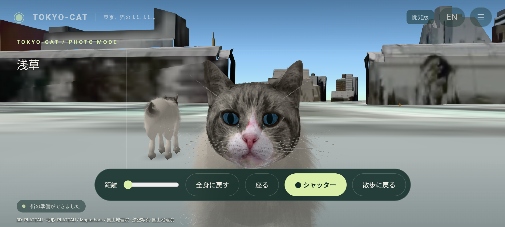
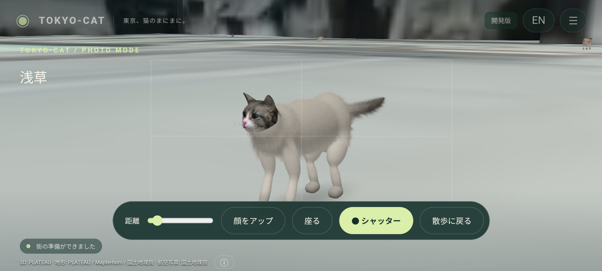

# 猫モデルのAndroid表示確認

2026-09-21、0.4.0-dev。最終GLBをAndroid Emulator / Cesium上で描画し、実際のタッチ操作で視点と姿勢を変更して撮影しました。写真品質の認定ではなく、モデルの表示・品種差・姿勢を確認する記録です。スクリーンショットは無加工です。

| 猫 | 正面 | 横 | 座位 |
| --- | --- | --- | --- |
| スコティッシュ・フォールド | [正面](screenshots/cat-scottish-front.png) | [横](screenshots/cat-scottish-side.png) | [座位](screenshots/cat-scottish-sit.png) |
| 混血猫 | [正面](screenshots/cat-mixed-front.png) | [横](screenshots/cat-mixed-side.png) | [座位](screenshots/cat-mixed-sit.png) |
| マンチカン | [正面](screenshots/cat-munchkin-front.png) | [横](screenshots/cat-munchkin-side.png) | [座位](screenshots/cat-munchkin-sit.png) |
| ラグドール | [正面](screenshots/cat-ragdoll-front.png) | [横](screenshots/cat-ragdoll-side.png) | [座位](screenshots/cat-ragdoll-sit.png) |
| ミヌエット | [正面](screenshots/cat-minuet-front.png) | [横](screenshots/cat-minuet-side.png) | [座位](screenshots/cat-minuet-sit.png) |
| サイベリアン | [正面](screenshots/cat-siberian-front.png) | [横](screenshots/cat-siberian-side.png) | [座位](screenshots/cat-siberian-sit.png) |
| ブリティッシュ・ショートヘアー | [正面](screenshots/cat-british-front.png) | [横](screenshots/cat-british-side.png) | [座位](screenshots/cat-british-sit.png) |
| アメリカン・ショートヘア | [正面](screenshots/cat-american-front.png) | [横](screenshots/cat-american-side.png) | [座位](screenshots/cat-american-sit.png) |
| ノルウェージャン・フォレスト・キャット | [正面](screenshots/cat-norwegian-front.png) | [横](screenshots/cat-norwegian-side.png) | [座位](screenshots/cat-norwegian-sit.png) |
| ラガマフィン | [正面](screenshots/cat-ragamuffin-front.png) | [横](screenshots/cat-ragamuffin-side.png) | [座位](screenshots/cat-ragamuffin-sit.png) |

歩行・走行の連続フレームは `screenshots/motion-walk-*.png` と `screenshots/motion-run-*.png`。足の接地の数値検証は [model-validation.txt](model-validation.txt) と [core-tests.txt](core-tests.txt) を参照。

10種類の表示検査で使ったGLBは最終APKのモデルと同じです。0.4では撮影中のNPC静止、全体操作、プロセス再起動も最終APKで検査しています。

## 顔の接写とまばたき

[FaceReviewTestの操作ログ](android-face-review.txt)。Android上で正面・斜め・横を表示し、自然に進行するBlinkを待って記録しました。生成テクスチャやBlenderのレンダーをゲーム画面として掲載したものではありません。

[斜め](screenshots/face-three-quarter.png) / [横顔](screenshots/face-side.png) / [まぶたが閉じた瞬間](screenshots/face-blink-0.png)

顔・鼻・口元・まぶたの形と毛の細部は0.3から変更しています。一方、目の光学表現や首との色のつながりなどには改良の余地があり、実写同等の完成品質とは評価していません。[仕様と制作元](../FACE.md)。

## 毛と全身

[FurReviewTestの操作ログ](android-fur-review.txt)。下毛・差し毛、胸元・頬・尾を確認しています。毛は半透明の湾曲した束で、体表の関節に追従します。独立した毛の物理計算ではありません。

[正面](screenshots/fur-front.png) / [横](screenshots/fur-side.png) / [座位](screenshots/fur-seated.png)

描画測定は顔の接写で20.76fps / p95 87.1ms、全身の接近表示で21.26fps / p95 78.1ms。各180描画間隔、標準画質、目標30fps。詳細は [VALIDATION.md](../VALIDATION.md)。エミュレーターの特定場面の値で、実機性能の保証ではありません。
